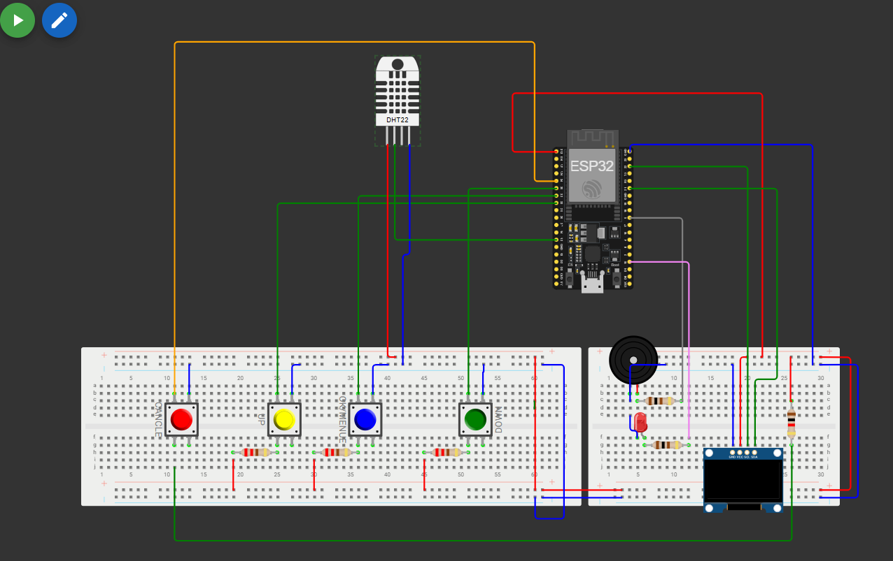
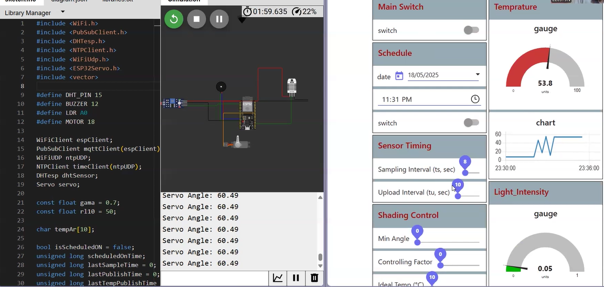

# 🩺 Smart Medibox using ESP32 & Node-RED

A Smart Medibox project designed to remind users to take medications on time while monitoring environmental conditions using ESP32 and IoT integration.
This project was developed using Visual Studio Code (VSCode) with the PlatformIO extension for coding and building the firmware. For hardware simulation and integration testing, the Wokwi Simulator was used to simulate the ESP32 and connected components before deploying to real hardware.



---

## 🛠️ Technologies and Components

### 🧰 Components

- **ESP32** Dev Module  
- **0.96" I2C OLED** Monochrome Display (SSD1306)  
- **DHT11** Temperature and Humidity Sensor  
- **LDR** (Light Dependent Resistor) + 10kΩ Resistor  
- **SG90** Servo Motor  
- **Buzzer**  
- **Push Buttons**  
- **Breadboard & Jumper Wires**

> ⚠️ *Note: The design was tested using the specified components. You may adjust as needed based on availability.*

---

## 🚀 Features

- ⏰ **Medication Reminder:** Alerts users at scheduled times.
- 🌡️ **Temperature and Humidity Monitoring:** Captures and reports environmental conditions.
- ☀️ **Lid Detection:** Detects whether the medibox is opened using an LDR.
- 📶 **MQTT Communication:** Sends real-time data to Node-RED.
- 📊 **Node-RED Dashboard:** Visualizes sensor data and system state.

---

## 🖥️ Node-RED Dashboard Preview with realtime working

|  | 

---

## 📦 Project Structure

```bash
Smart-Medibox/
├── medibox_stage1/    # Wokwi simulation code
├── medibox_stage2/       # ESP32 MQTT + Node-RED code
├── images/                # Screenshots and diagrams
├── README.md
